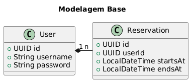

# Desafio de Projeto 'Criando um APP Full Stack de Agendamento de Barbearia com Java e Angular'
Nesse desafio, é proposta a criação de um sistema funcional de agendamento para uma barbearia;
Consiste na criação de um Front-End com Angular e um Back-End com Java e Spring.

## Back-End / API

### Planejamento

#### Entidades do Sistema


### Setup

#### Base
Utilizando a ferramenta [Spring Initializr](https://start.spring.io), foi gerado um projeto Spring com alguns starters que serão utilizados na construção do projeto. Esse projeto gerado irá servir como base para o desenvolvimento da API.


#### Dependências Iniciais Adicionais

##### OpenAPI / SwaggerUI - SpringDoc
A dependência SpringDoc adiciona suporte a OpenAPI e SwaggerUI na aplicação.
Adicionada com a seguinte estrutura ao arquivo pom.xml:
```
<dependency>
    <groupId>org.springdoc</groupId>
    <artifactId>springdoc-openapi-starter-webmvc-ui</artifactId>
    <version>2.8.5</version>
</dependency>
```

##### Spring Starter Validation
A dependência spring starter validation permite validação de dados na aplicação.
Adicionada com a seguinte estrutura no arquivo pom.xml:
```
<dependency>
    <groupId>org.springframework.boot</groupId>
    <artifactId>spring-boot-starter-validation</artifactId>
    <version>3.4.3</version>
</dependency>
```

## Front-End
Aqui não vou seguir nenhum planejamento muito definido; Parto dos reguintes requisitos para montar as telas:
- Realizar registro de usuário;
- Realizar agendamento;
- Listar agendamentos;
- Editar agendamento.

### Setup
O projeto foi gerado utilizando a CLI do Angular, comando `ng new`.

#### Dependências Iniciais Adicionais
Foi adicionada a library de componentes Angular Material; Adicionada com o seguinte comando: `ng add @angular/material`.

## Referências
- [Baeldung - Spring Data JPA @Query](https://www.baeldung.com/spring-data-jpa-query)
- [Baeldung - Hibernate One to Many Annotation Tutorial](https://www.baeldung.com/hibernate-one-to-many)
- [Baeldung - Validation in Spring Boot](https://www.baeldung.com/spring-boot-bean-validation)
- [Getting Started with Angular Material](https://material.angular.io/guide/getting-started)