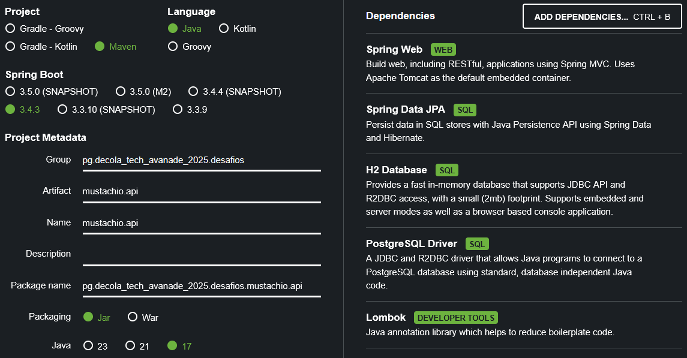

# Desafio de Projeto 'Criando um APP Full Stack de Agendamento de Barbearia com Java e Angular'
Nesse desafio, é proposta a criação de um sistema funcional de agendamento para uma barbearia;
Consiste na criação de um Front-End com Angular e um Back-End com Java e Spring.

## Back-End / API

### Setup
#### Base
Utilizando a ferramenta [Spring Initializr](https://start.spring.io), foi gerado um projeto Spring com alguns starters
que serão utilizados na construção do projeto. Esse projeto gerado irá servir como base para o desenvolvimento da API.


#### Dependências Iniciais Adicionais
##### OpenAPI / SwaggerUI - SpringDoc
A dependência SpringDoc adiciona suporte a OpenAPI e SwaggerUI na aplicação.
Adicionada com a seguinte estrutura ao arquivo pom.xml:
```
<dependency>
    <groupId>org.springdoc</groupId>
    <artifactId>springdoc-openapi-starter-webmvc-ui</artifactId>
    <version>2.8.5</version>
</dependency>
```

## Referências
- [Telusko - Spring Security 6 with Spring Boot and JWT Tutorial](https://www.youtube.com/watch?v=oeni_9g7too)